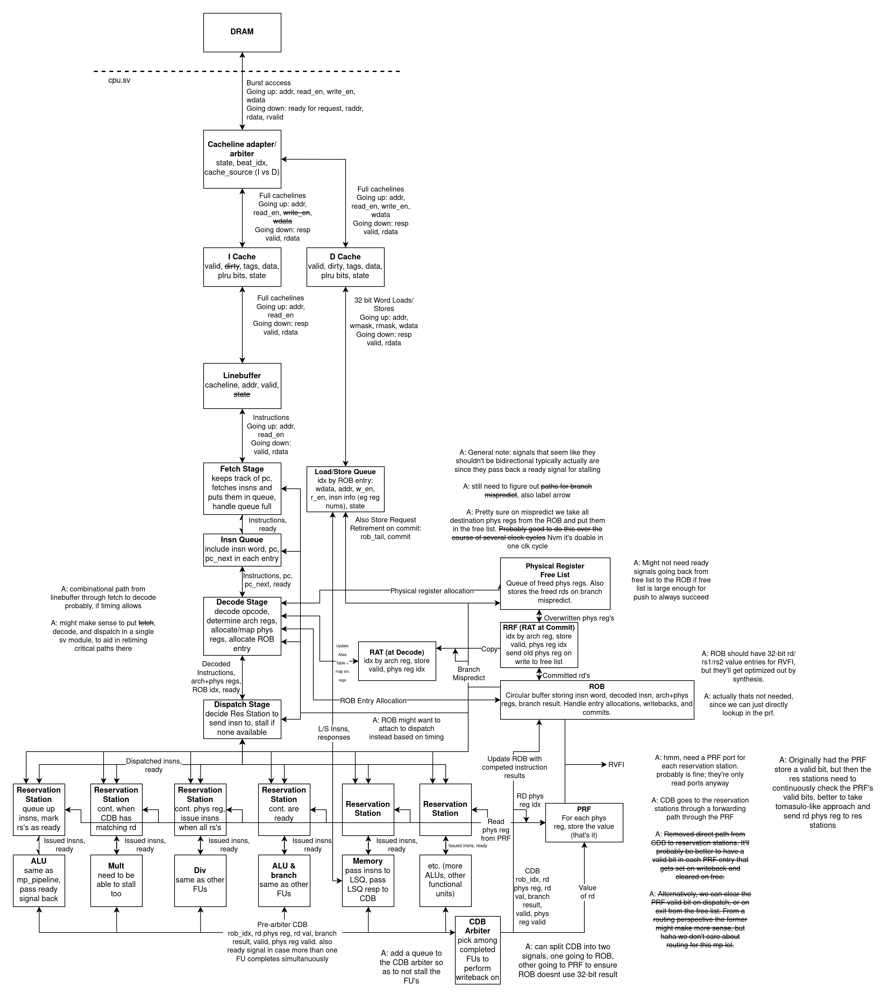

# Out-of-Order Processor

A SystemVerilog out-of-order RV32IM processor built around explicit register renaming, in-order retirement, and a split cache hierarchy. This repository is organized as a portfolio project for processor design roles: the top-level overview is concise enough for a quick review, while the supporting documents go deeper into microarchitecture, verification, and development flow.

The design focuses on the mechanics that make an OoO core interesting in practice: rename and dependency tracking, reservation-station-based scheduling, ROB-controlled retirement, multi-cycle execution units, instruction/data cache integration, and front-end control-hazard reduction through branch prediction.

## Highlights

- `RV32IM` execution core in SystemVerilog
- Explicit register renaming with `RAT`, `RRF`, `PRF`, and `freelist`
- In-order commit via `ROB` with out-of-order issue and writeback
- `reservation stations` and `CDB`-style result broadcast path
- Split instruction and data cache hierarchy with cacheline adapter
- Instruction-side `line buffer` to sustain fetch throughput within a cache line
- Integer `ALU`, `multiply`, and `division` functional units
- `GShare + BTB` branch predictor integrated at fetch
- Simulation, lint, and synthesis collateral included in-repo

## Block Diagram

## Microarchitecture Summary

The processor uses an explicit-register-renaming back end rather than storing speculative values in an architectural register file. Decode allocates a new physical destination register, records program order in the reorder buffer, and dispatches work into reservation stations. Ready instructions issue into the functional units, results are broadcast on the common data path, and retirement happens strictly in program order.

At the front end, fetch works with an instruction queue and a line buffer that reuses an already-fetched 256-bit cache line for sequential instruction access. This avoids redundant cache traffic and supports a steady fetch stream within a cache line. A GShare predictor with a branch target buffer reduces control-hazard cost by steering fetch before branch resolution reaches retirement.

More detail:
- [Architecture](docs/architecture.md)
- [Verification](docs/verification.md)
- [Development](docs/development.md)

## Verification Snapshot

Verification combines directed assembly tests, random instruction generation, co-simulation collateral, and benchmark execution. The repository includes flows for VCS and Verilator, along with supporting infrastructure for memory-image generation, log capture, and benchmark runs.

Correctness and performance are treated separately:
- Correctness: unit-level and full-system simulation, dependency stress tests, branch/memory corner cases, and architectural-reference checking infrastructure
- Performance: workload runs on CoreMark and application-style benchmarks to compare baseline and enhanced configurations

For concrete Linux commands to build, run, and extract IPC numbers, see [Verification](docs/verification.md) and [Development](docs/development.md).
The reference execution flow assumes a Linux EDA environment with VCS, DesignWare models, Spike, and a RISC-V cross toolchain available in the shell.

## Performance Notes

Project notes in the preserved design report show measurable IPC gains after integrating the branch predictor. The strongest uplift appears on branch-heavy or control-sensitive workloads, while arithmetic-heavy kernels still show moderate benefit.

| Benchmark | Baseline IPC | GShare + BTB IPC |
| --- | ---: | ---: |
| `aes_sha` | 0.2919 | 0.2990 |
| `compression` | 0.2855 | 0.4930 |
| `fft` | 0.4073 | 0.4657 |
| `mergesort` | 0.3356 | 0.3500 |
| `coremark` | 0.2967 | 0.366766 |

These numbers are useful as design-history evidence rather than as a polished benchmark campaign; the current documentation focuses on the architectural takeaway instead of overstating the result.

## Repository Layout

- `hdl/`: core RTL, including front end, rename logic, scheduling structures, caches, and functional units
- `pkg/`: shared SystemVerilog type/package definitions
- `hvl/`: simulation testbench and reference-monitor collateral
- `sim/`: VCS and Verilator build/run flow
- `lint/`: SpyGlass lint flow
- `synth/`: synthesis and power-analysis flow
- `testcode/`: assembly tests, random generators, and benchmark binaries
- `docs/`: portfolio-facing technical documentation

## Provenance Note

This repository preserves some legacy collateral from an earlier team-based development context. Those source documents are retained under `docs/archive/` for traceability and writing reference, but the public-facing narrative in this repository is the rewritten portfolio documentation above.
